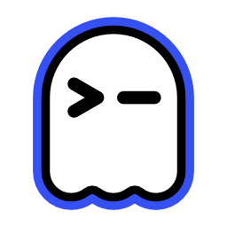
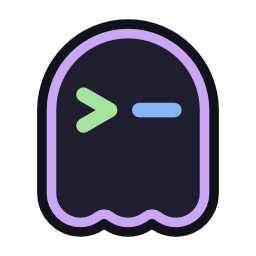
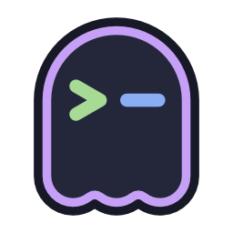
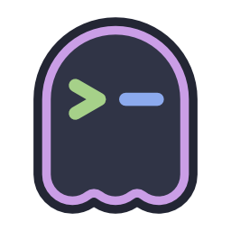
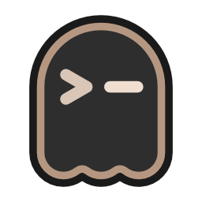
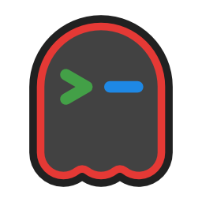

# Ghostty App Icon

An unofficial Ghostty app icon for macOS, based on the [SVG logo](https://ghostty.org/_next/static/media/ghostty-logo.6cca3a6b.svg) from the [Ghostty](https://ghostty.org/download) website.

## Downloads

